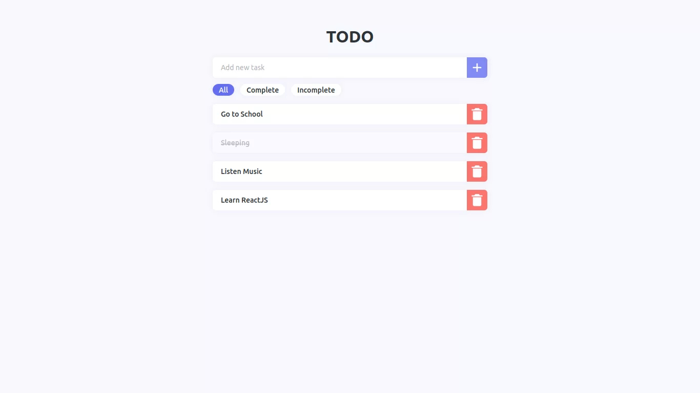
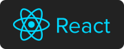

## About Project



Simple Todo application using web-based by utilizing Local Storage for data storage.

### JSON Structure

```JSON
[
  {
    "id": "1ded1ac-ee8b-58b1-26e-7360da2200c1",
    "name": "Go to School",
    "isComplete": false,
    "updatedAt": 1652448615077
  }
]
```

### Built With

[](https://reactjs.org/)

## Getting Started

### Prerequisites

```sh
npm install npm@latest -g
```

### Installation

1. Clone the repo

```sh
git clone https://github.com/herdianurdin/todo-lesson-rjs.git
```

2. Install NPM packages

```sh
npm install
```

## Usage

### Run Project

```sh
npm run start
```

### Build Project

```sh
npm run build
```

## License

Distributed under the CC0-1.0 license. See [LICENSE](LICENSE) for more information.
